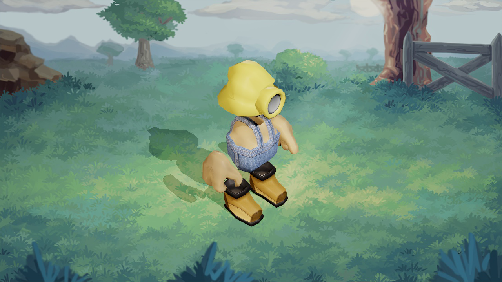

# Mercury

An open-source monster raising and combat game

## Pre-built Binaries

Pre-built binaries are available [on Itch.io](https://mogurijin.itch.io/mercury).
To use these, download the appropriate version for your platform and extract the archive.
Then run the `mercury` binary (`mercury.exe` on Windows).

## Configuration

Configuration is currently done by adding and modifying a `config/user.prc`.
This file is loaded after all over config so it will override the config in the other `config/*.prc` files.

## Documentation

Documentation about the game can be found [here](https://mercury-game.readthedocs.io/en/latest/).

## Development

### Dependencies

* Python 3.7+
* Python packages in `requirements.txt`
* Blender 2.90+ (preferably on the system PATH)
* [Git LFS](https://git-lfs.github.com/)

### Getting started

* Clone the repo
* Setup a [virtual environment](https://docs.python.org/3/tutorial/venv.html) (optional, but recommended)
  * Activate the virtual environment on Windows with `<venv-dir>\Scripts\activate.bat`
  * Activate the virtual environment on Linux with `. <venv-dir>/bin/activate`
* Install dependencies: `pip install -r requirements.txt`
* Run the game use `pman run` or `python main.py`
* To build game assets without running use `pman build` (this is done automatically as part of `run`)

### Configuration

The game can be configured using [Panda3D PRC variables](https://docs.panda3d.org/1.10/python/programming/configuration/list-of-all-config-variables).
A default configuration exists in `config` for user inputs (`config/inputs.prc`) and general game settings (`config/game.prc`).
These files are submitted to version control and should only be modified when changing the defaults

User configuration can be found in `config/user.prc` (make this file if it does not exist).
This config file is loaded last, which means it can be used to override other config.

In addition to the base Panda3D PRC variables, this project defines some custom ones

* `msaa-samples` (int) - the number of samples to use for multisample anti-aliasing (default: `4`)
* `enable-shadows` (bool) - enables shadow map shadows (default: `true`)
* `audio-music-volume` (double) - the background music volume from 0.0 to 1.0 (default: `1.0`)
* `audio-sfx-volume` (double) - the sound effect volume from 0.0 to 1.0 (default: `1.0`)
* `mercury-initial-state` (string) - a state name to load instead of loading the title screen state (default: `Title`)
* `mercury-default-form` (string) - ID of which form to use when generating the default monster used when skipping states (default: `mine`)
* `mercury-default-monster` (string) - ID of a monster file to load for the default monster used when skipping states (default: `''`; overrides the default form if set)

### Running tests

Install test dependencies with:

```bash
python -m pip install -e .[test]
```

Run tests with pytest:

```bash
python -m pytest
```

## License

* Anything mentioned in [CREDITS.md](CREDITS.md) have licenses as specified in the file
* Any remaining code is [Apache-2.0](https://choosealicense.com/licenses/apache-2.0/)
* Any remaining assets are [CC BY-SA 4.0](https://creativecommons.org/licenses/by-sa/4.0/)
